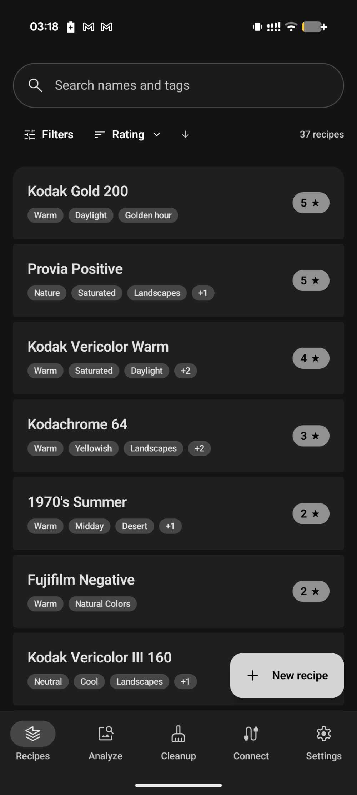
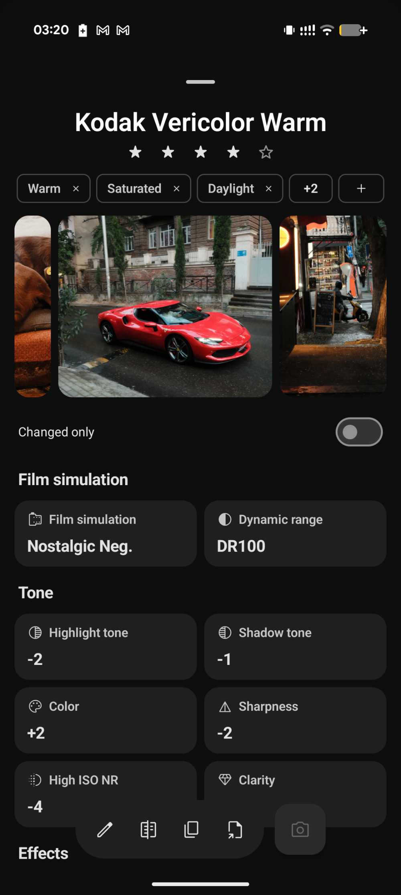
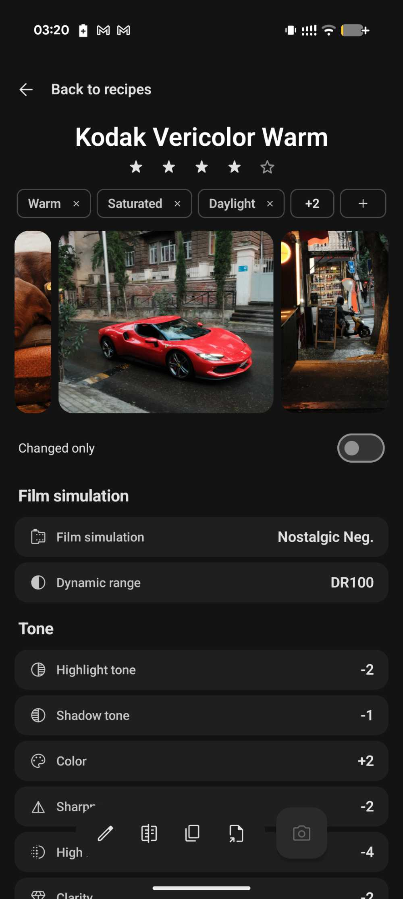
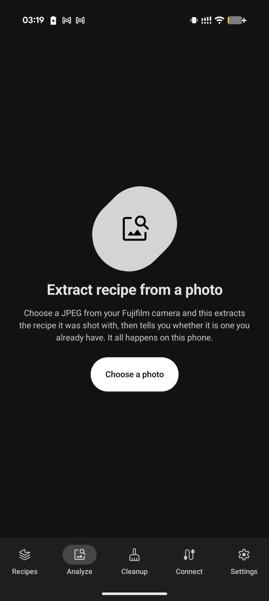
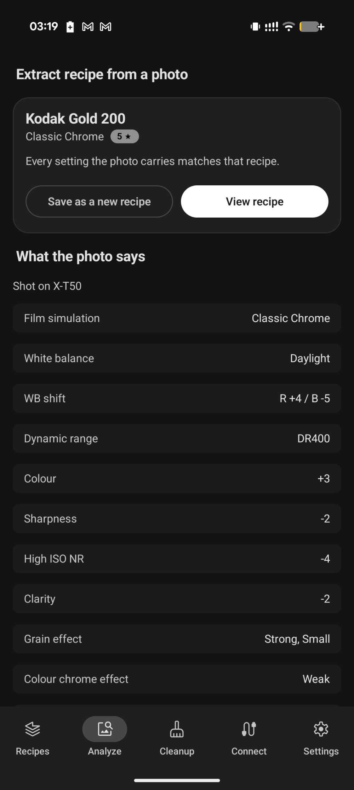
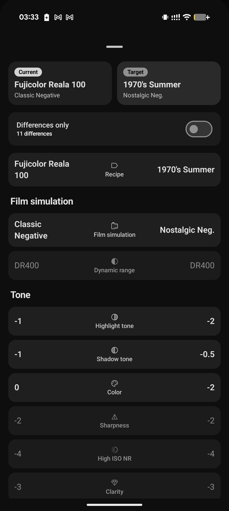
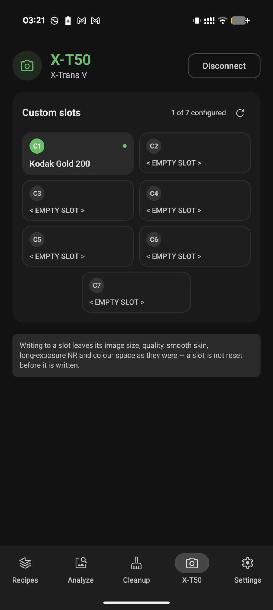
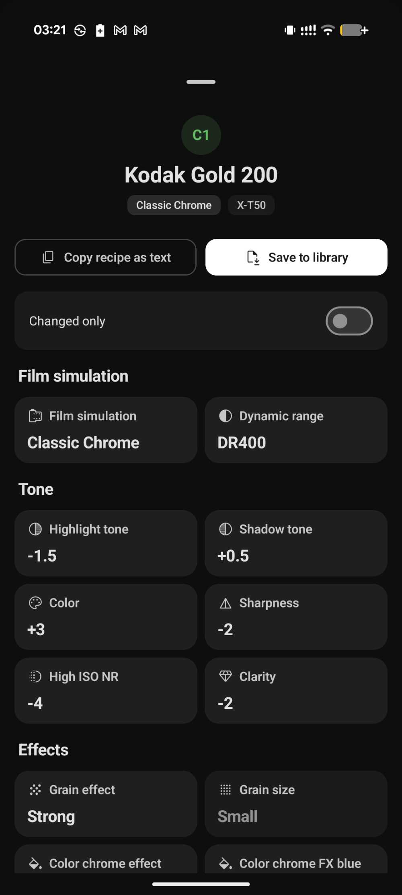
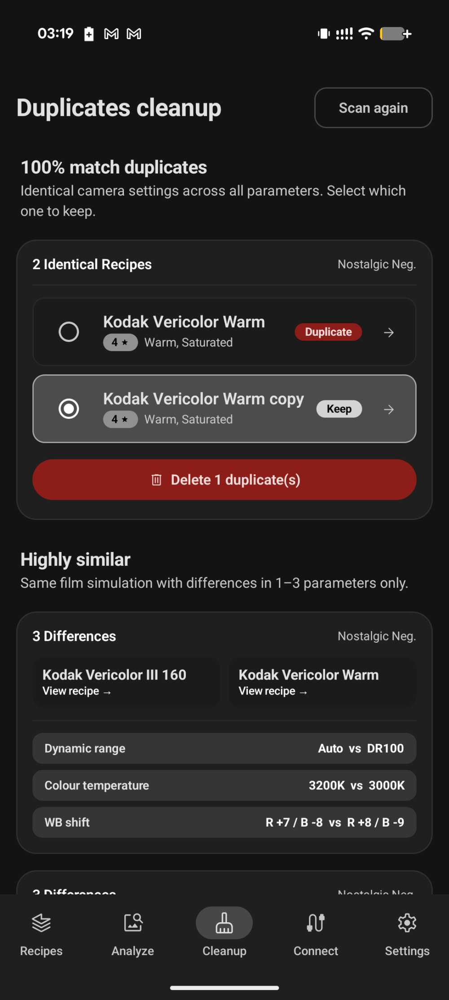
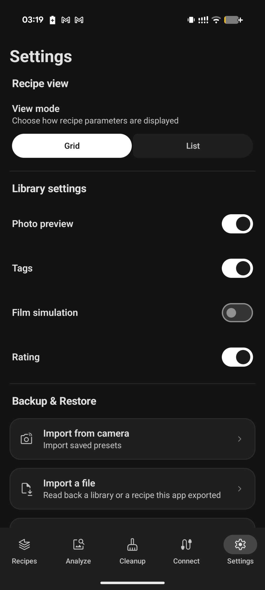

# 📷 Fuji Recipes (Android)

[-3DDC84.svg?style=flat&logo=android)](https://developer.android.com)
[](https://kotlinlang.org)
[](https://developer.android.com/jetpack/compose)
[-009688.svg?style=flat)](https://github.com/justbondarenko/fuji-recipes-app)
[](https://github.com/justbondarenko/fuji-recipes-app)
[](LICENSE)

**Fuji Recipes** is a native, local-first Android companion app for Fujifilm camera owners. It lets you collect, create, organize, and fine-tune film simulation recipes on your phone and **write them directly to your camera's C1–C7 custom slots over a USB-C cable** — completely offline with zero cloud dependencies.

> [!NOTE]
> **About this project**: I am not a professional photographer — just a Fujifilm camera owner and developer with insomnia :D. This app was vibecoded first and foremost as a personal project for personal use, experimentation, and entertainment, but shared openly with the public because, why not! :)
>
> It is provided completely free and **"as is"**. While I cannot make any commercial promises or guarantees, I am very happy to receive feedback, collaborate with fellow Fuji owners, and update/fix issues as they arise!

---

## 📑 Table of Contents

- [📥 Installation](#-installation)
- [📱 Screenshots](#-screenshots)
- [🌟 Highlights](#-highlights)
- [📸 Camera Compatibility & Testing](#-camera-compatibility--testing)
- [🔌 Connecting Your Camera (How to Use)](#-connecting-your-camera-how-to-use)
  - [1. Set Camera USB Mode](#1-set-camera-usb-mode)
  - [2. Connect via USB-C](#2-connect-via-usb-c)
  - [3. Read or Write Recipes](#3-read-or-write-recipes)
- [🧪 Testing & Feedback](#-testing--feedback)
- [🛠️ Building & Developing](#️-building--developing)
  - [Prerequisites](#prerequisites)
  - [Clone & Build](#clone--build)
  - [Sideload to Device](#sideload-to-device)
- [☕ Open Source Acknowledgements](#-open-source-acknowledgements)
- [📜 Legal Disclaimer & Trademarks](#-legal-disclaimer--trademarks)

---

## 📥 Installation

Grab the latest APK from the [Releases page](https://github.com/justbondarenko/fuji-recipes-app/releases) and install it on your phone.

> [!NOTE]
> **"App blocked to protect your device" / Play Protect warning**:
> Since this app is distributed directly via GitHub Releases rather than the Google Play Store, Android's **Play Protect** has no install history for it and will warn that it "hasn't seen this app from this developer before." This is expected for any app sideloaded outside Play — it's not a sign of malware, just a reputation check Play Protect can only build up through Play Store distribution.
>
> To install anyway: on the warning screen, tap **More details** → **Install anyway**.

### Not sure it's safe? Ask an AI to check for you

You don't have to take my word for it. Point any AI coding assistant (Claude, ChatGPT, Gemini, etc.) at this repository and ask it to independently verify the app's behavior — the source code is public, so it can check for itself rather than trusting this README.

Example prompt:

```
Review the source code at https://github.com/justbondarenko/fuji-recipes-app. I'm about to sideload the released APK and want an independent safety check before I do.

First, confirm you actually fetched and read files from that URL — don't guess. If you can't browse live URLs, say so explicitly instead of assuming the repo is empty or has no source code, and tell me what you'd need me to paste instead (e.g. AndroidManifest.xml, build.gradle.kts).

Once you've confirmed access, answer:

1. Does the app request or use INTERNET or any network-related permission? Search the manifest and codebase for any networking code (HTTP clients, sockets, analytics/crash-reporting SDKs, ad SDKs).
2. What permissions does AndroidManifest.xml declare, and is each one justified by what the app actually does (e.g. USB access for the camera connection, storage for saving recipes)?
3. Does the app collect, log, or transmit any personal data, camera contents, or device identifiers anywhere?
4. Are there any obfuscated, minified, or suspicious code paths that don't match what's described in the README?
5. Overall, is there any risk to me in installing this app — to my data, my device, or my camera — and if so, what exactly is it?

Give me a plain verdict: is this app safe to install, based only on what's in the repository?
```

Because the app is 100% offline with zero network access, any AI that actually reads the source will confirm there's no code path capable of sending data anywhere — there's simply no networking code to send it with.

> [!WARNING]
> **Some AI chat tools can't actually browse a URL you give them.** When that happens, instead of saying "I can't access this," they can confidently claim the repo has no source code, no manifest, etc. — which is *wrong*, not a real finding. The source is genuinely public (`app/src/main/AndroidManifest.xml`, `app/build.gradle.kts`, and the rest of `app/src/`). In practice, Claude and ChatGPT seem to actually fetch and explore the repository, while Gemini has been observed just implying/guessing at an answer instead of checking. If you get a "no code found" response, either enable that AI's live browsing/search mode and retry, or `git clone` the repo yourself and paste the relevant files directly into the chat.

---

## 📱 Screenshots

| Recipe Library | Recipe View (Grid) | Recipe View (List) |
| :---: | :---: | :---: |
|  |  |  |

| Photo EXIF Extractor | Recipe Matching & Diff | Side-by-Side Comparison |
| :---: | :---: | :---: |
|  |  |  |

| USB-C Camera Sync | Custom Slots (C1–C7) | Duplicates Clean-Up |
| :---: | :---: | :---: |
|  |  |  |

| Settings & View Modes |
| :---: |
|  |

---

## 🌟 Highlights

- ⚡ **Direct USB-C Camera Sync**: Connect your camera to your phone via USB-C. The app launches automatically on connection, reads your current `C1`–`C7` custom slot states, and writes full recipe parameter sets directly to the camera body in seconds.
- 📥 **Import Directly from Camera**: Read existing custom slot recipes off the camera body and save them straight into your offline phone library.
- 📸 **Extract Recipe from Photo**: Pick any straight-out-of-camera Fujifilm JPEG to decode its embedded MakerNote EXIF metadata. The app extracts the exact film simulation, tone curves, and white balance settings, checks whether you already have it in your library, or lets you save it as a new recipe.
- 🔍 **Highlight Matching & Likely Recipes**: When analyzing photos, the app compares decoded parameters against your entire library, highlighting exact matches or surfacing likely recipe candidates with percentage similarity and specific differences.
- 🧹 **Duplicate Detection & Clean-Up**: Intelligent review flow detects duplicate and conflicting recipes during camera or file imports, allowing you to easily resolve collisions, replace older versions, or skip duplicates to keep your library clean.
- 📝 **Create from Pasted Text**: Copy recipe text from websites (like *Fuji X Weekly*), forums, or notes. The built-in parser automatically identifies parameters and pre-fills the recipe editor.
- ⚖️ **Side-by-Side Recipe Comparison**: Compare any two recipes in your library to inspect exact parameter differences side by side.
- 🗂️ **Comprehensive 27-Parameter Engine**: Full support for Fujifilm recipe parameters across sensor generations — Film Simulations (Provia to Reala Ace), Grain Size/Effect, Color Chrome FX & FX Blue, Smooth Skin, Highlight/Shadow tone curves (0.5 steps), Clarity, and 2D White Balance shift with Kelvin temperature.
- 🔒 **100% Offline & Private**: Declares **zero `INTERNET` permissions**. Your recipes live exclusively in app-private storage on your phone (`filesDir/library.json`). No accounts, no cloud sync, and no tracking.
- 📦 **Lossless Export & Import**: Export your library as a single `.json` file or a `.zip` archive using Android's Storage Access Framework and system share sheet.
- 🎨 **Material 3 Expressive UI**: Built with Material You Dynamic Color adapting fluidly to your device theme, expressive spring motion, and dark/light mode support.

---

## 📸 Camera Compatibility & Testing

Camera communication is handled via PTP (Picture Transfer Protocol) over USB Host mode.

* 🟢 **Tested & Verified on Hardware**: **Fujifilm X-T50** (the only body I personally own)
* 🟡 **Expected to Work (Untested on Hardware — Feedback Welcome!)**:
  * **X-Trans V bodies** (*X-T5, X100VI, X-H2, X-H2S, X-S20, X-M5, X-E5*)
  * **X-Trans IV bodies** (*X-T4, X-T3, X-T30, X-T30 II, X-Pro3, X-S10, X-E4, X100V*)
  * **GFX 100-series** (*GFX100 II, GFX100, GFX100S, GFX100S II*)
* 🔴 **Known Hardware Limitations (Custom slot writing not supported by camera firmware)**:
  * **X-Trans III & older** (*X-Pro2, X-T2, X-T20, X-E3, X-H1, X100F*)
  * **Bayer CMOS & GFX 50-series** (*X-T100, X-T200, X-A series, GFX 50S, GFX 50R, GFX50S II, XF10*)
  *(These camera bodies lack custom slot write registers in their firmware; recipe library management and photo EXIF extraction still work normally.)*

> 💬 **Feedback & Collaboration**: If you own an untested Fujifilm camera body and would like to help verify compatibility or report issues, please [open an issue on GitHub](https://github.com/justbondarenko/fuji-recipes-app/issues)! I'm happy to update and fix anything that comes up.

---

## 🔌 Connecting Your Camera (How to Use)

### 1. Set Camera USB Mode
Turn on your camera and configure the USB mode:
- Navigate to **`MENU / OK` → `SET UP` (Wrench) → `CONNECTION SETTING` → `USB MODE`**
- Set to **`USB RAW CONV. / BACKUP RESTORE`**

### 2. Connect via USB-C
- Connect a **USB-C to USB-C** cable between your Android phone and camera.
- The phone will prompt you to open **Fuji Recipes** automatically via the USB device attach intent.
- Switch to the **Camera** tab in the bottom navigation bar to view your camera connection status and read the current custom slot contents.

### 3. Read or Write Recipes
- **Writing a recipe**: Open any recipe → tap **Write to camera** → choose target slot (`C1` through `C7`) → confirm write.
- **Reading from the camera**: In the **Camera** tab or via **Settings (`More`) → Import from camera**, read all custom slots from the body into your library.

---

## 🧪 Testing & Feedback

Any feedback, bug reports, and compatibility test results are welcome!

- **Found a bug or tested a new camera model?** Please [open an issue on GitHub](https://github.com/justbondarenko/fuji-recipes-app/issues) with your camera model, phone model, and Android version.
- **Direct contact & social links**: Open the in-app **About** screen (**Settings (`More`) → About**) for direct email and contact links.

---

## 🛠️ Building & Developing

### Prerequisites
- **Android Studio** Ladybug (2024.2.1+) or newer
- **JDK 17** (or Android Studio bundled JBR)
- **Android SDK Platform 37** (`compileSdk = 37`, `minSdk = 29`)
- An Android device with USB Host mode support (API 29+ / Android 10+)

### Clone & Build
```bash
# Clone the repository
git clone https://github.com/justbondarenko/fuji-recipes-app.git
cd fuji-recipes-app

# Run all unit tests
./gradlew testDebugUnitTest

# Assemble debug APK
./gradlew :app:assembleDebug
```

The compiled APK will be at:
`app/build/outputs/apk/debug/app-debug.apk`

### Sideload to Device
```bash
adb install -r app/build/outputs/apk/debug/app-debug.apk
```

> [!TIP]
> **Wireless Debugging**:
> Because the phone's USB-C port is occupied by the camera during hardware testing, use **Wireless ADB** (`adb pair` and `adb connect`) for live logcat inspection and debugging.

---

## ☕ Open Source Acknowledgements

This project is built using fantastic open-source libraries, tools, and research:

### Android & Kotlin Ecosystem
- [Jetpack Compose & Material 3 Expressive](https://developer.android.com/jetpack/compose) — Modern declarative UI toolkit and Material 3 components.
- [Kotlin & Kotlinx Coroutines / Serialization](https://github.com/Kotlin/kotlinx.serialization) — Reactive streams and JSON serialization.
- [Coil](https://github.com/coil-kt/coil) — Image loading for Compose.
- [AndroidX DataStore](https://developer.android.com/topic/libraries/architecture/datastore) — Reactive key-value storage.
- [Google Fonts Material Symbols Rounded](https://fonts.google.com/icons) — Clean iconography.
- [Turbine](https://github.com/cashapp/turbine) & [JUnit](https://junit.org/) — Flow testing and unit testing.

### Camera Protocol & Reverse-Engineering Research
- [**filmkit** (`eggricesoy/filmkit`)](https://github.com/eggricesoy/filmkit) (MIT License) — Research on Fujifilm PTP property ranges, parameter encoding, and custom slot codes.
- [**FujiHack Community** (`fujihack/fujihack`)](https://github.com/fujihack/fujihack) (GPL-3.0 License) — Reverse-engineering documentation, PTP/USB communication research, and MakerNote tag structures. Referenced as technical documentation for camera interoperability.

---

## 📜 Legal Disclaimer & Trademarks

### 1. Independent Personal Project & Non-Affiliation
Fuji Recipes is an independent personal open-source utility developed for private use and experimentation. It is **not** an official product of, nor is it endorsed, certified, supported, sponsored, or affiliated with **FUJIFILM Corporation** or any of its subsidiaries.

### 2. "AS IS" Software Disclaimer
Fuji Recipes is provided strictly on an **"AS IS"** and **"AS AVAILABLE"** basis under the MIT License without warranties of any kind, whether express, implied, statutory, or otherwise. To the maximum extent permitted by applicable law, the developer expressly disclaims all warranties, including but not limited to implied warranties of merchantability, fitness for a particular purpose, title, and non-infringement.

### 3. Camera Connection & Protocol Risks
Connecting a camera to a mobile device via USB (Picture Transfer Protocol / PTP) involves low-level data communication with the camera's internal firmware, memory controllers, and volatile custom preset registers. You acknowledge that USB communication carries inherent risks, including unexpected disconnections, protocol errors, camera lockups, or parameter corruption.

### 4. Limitation of Liability & User Assumption of Risk
All use of this application — including creating recipes, modifying custom slots, transferring presets to or from cameras, and importing or exporting files — is performed entirely at your own discretion, judgment, and sole risk. 

To the fullest extent permitted by applicable law, in no event shall the developer, contributors, or copyright holders be liable for any direct, indirect, incidental, special, consequential, exemplary, or punitive damages (including, without limitation, camera inoperability, firmware corruption, data loss, photo loss, hardware failure, repair costs, or loss of profits) arising out of or in connection with the software or the use of the software.

### 5. Trademarks & Brand Acknowledgements
`FUJIFILM`, `FUJINON`, `X-Trans`, and all film simulation designations (*Provia*, *Velvia*, *Astia*, *Classic Chrome*, *PRO Neg*, *Classic Negative*, *Nostalgic Neg*, *Eterna*, *Acros*, *Reala Ace*, etc.) are trademarks or registered trademarks of **FUJIFILM Corporation**. Reference to these names, marks, and technologies is made solely for descriptive, identification, and technical interoperability purposes.

### 6. Third-Party Brands, Logos & Intellectual Property
All other product names, logos, brand identities, websites, trademarks, service marks, trade names, or intellectual property referenced, displayed, or mentioned within this application or documentation are the property of their respective owners. Any reference to such third-party names, websites, logos, or brands is made purely for informational, reference, and interoperability purposes only, and does not constitute or imply any affiliation, sponsorship, endorsement, association, or partnership with the developer.

---

Created for personal use and shared with the Fujifilm community by **[Andrii Bondarenko](https://github.com/justbondarenko)**.
