# 📱 Fuji Recipes — Screenshots

A walkthrough of the app, screen by screen. Everything below happens on the phone, offline, over a USB-C cable to the camera — no accounts, no network.

[← Back to the main README](../README.md)

**Jump to:** [Recipe library](#-the-recipe-library) · [Viewing a recipe](#-viewing-a-recipe) · [Developing a RAW](#-developing-a-raw-in-the-camera) · [Creating recipes](#-creating-recipes) · [Analysing photos](#-analysing-photos) · [Camera & custom slots](#-camera-connection--custom-slots) · [Maintenance](#-maintenance--tools)

---

## 🗂 The recipe library

| 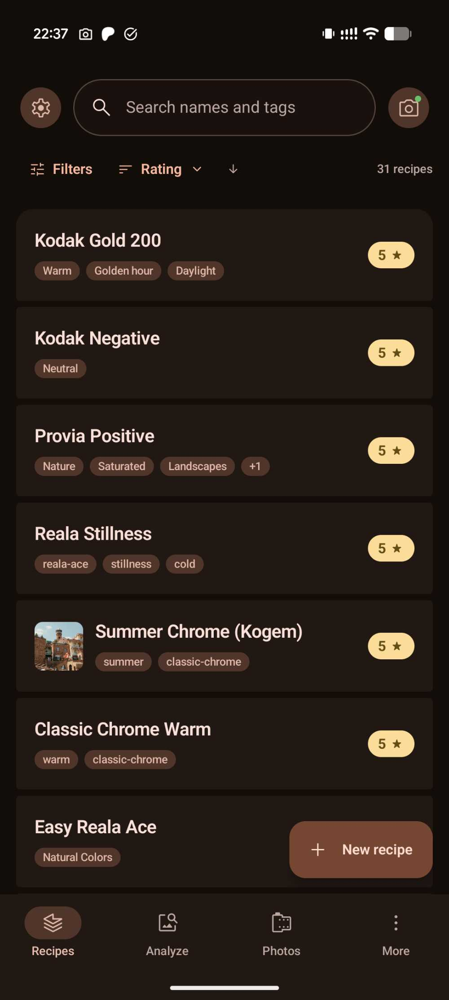 | 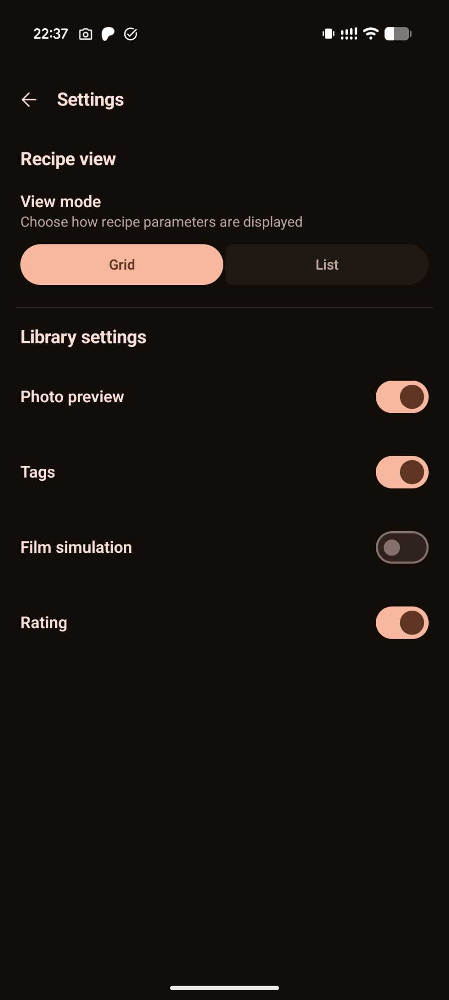 |
|:--:|:--:|
| **Recipe list** — your whole library on one screen. Search by name or tag, filter, and sort (here by rating). Recipes with sample photos attached show a thumbnail. The round button on the left of the search row opens Settings; the camera button on the right shows the current USB connection state (green dot = camera connected). Long-pressing a recipe starts multi-select for batch delete or batch rating. | **Display settings** — control how much each recipe shows. Switch the detail screen between **Grid** and **List** layout, and toggle what the library rows display: photo preview, tags, film simulation and rating. Useful for keeping a 30+ recipe library readable. |

## 🔍 Viewing a recipe

| 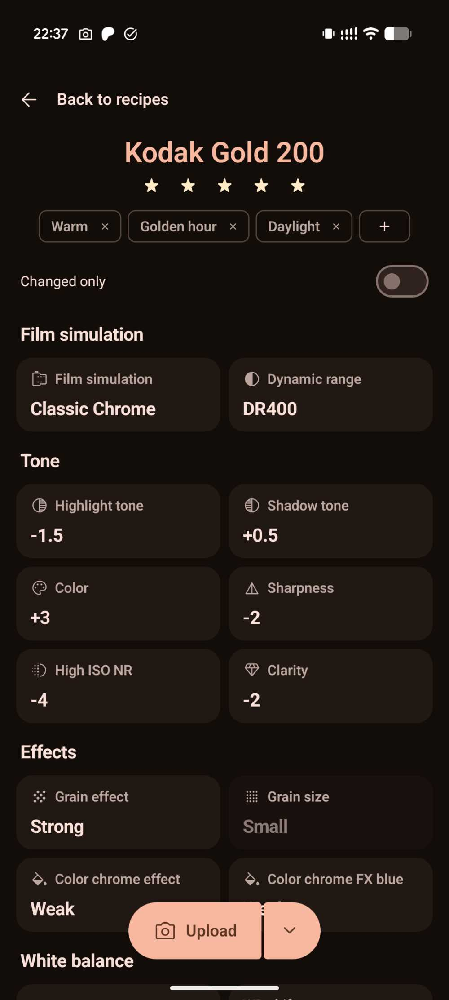 | 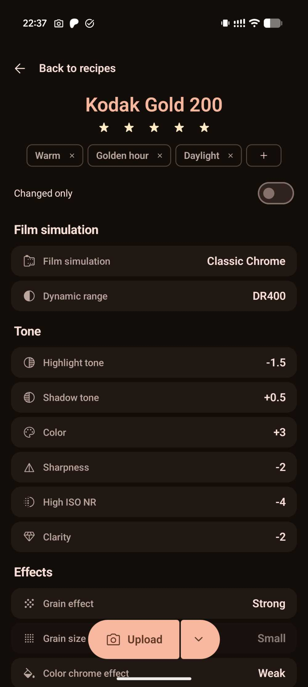 |
|:--:|:--:|
| **Grid view** — all 27 Fujifilm parameters as two-column cards, grouped into Film simulation, Tone, Effects and White balance. Values are shown exactly as the camera expects them (highlight/shadow tone in 0.5 steps, DR mode, grain size and effect, Color Chrome FX). Dimmed cards are parameters left at their default. | **List view** — the same recipe as a compact label-and-value list. Better when you are reading settings off the phone while dialling them into the camera by hand. The **Changed only** toggle at the top hides every parameter still at its default, so you see just what makes this recipe different. |

| 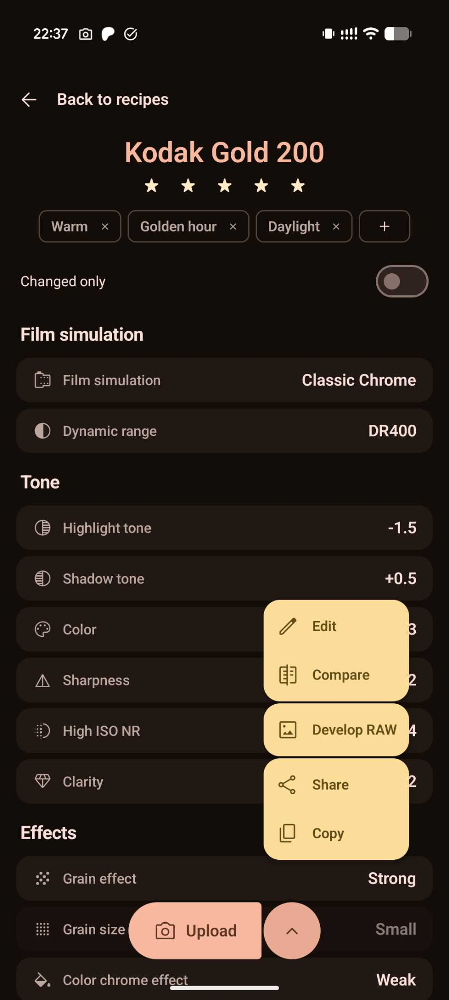 | 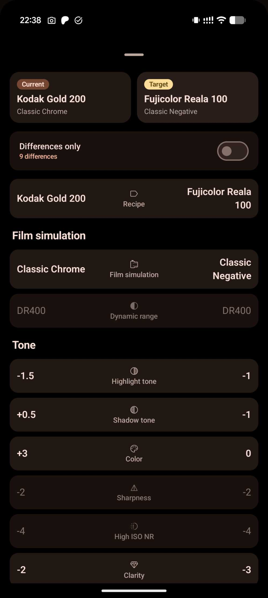 |
|:--:|:--:|
| **Recipe actions** — the split button at the bottom sends the recipe to the camera (**Upload** writes it into a C1–C7 custom slot), and its menu holds everything else: **Edit**, **Compare** against another recipe, **Develop RAW** using the camera's own processor, **Share** as a file, and **Copy** to duplicate it as a starting point. | **Side-by-side comparison** — put any two recipes next to each other, parameter by parameter, with the current recipe on the left and the target on the right. Differing values are highlighted and counted (here 9 differences); **Differences only** hides everything the two recipes agree on. The fast way to see what actually separates two lookalike recipes. |

## 🎞 Developing a RAW in the camera

| 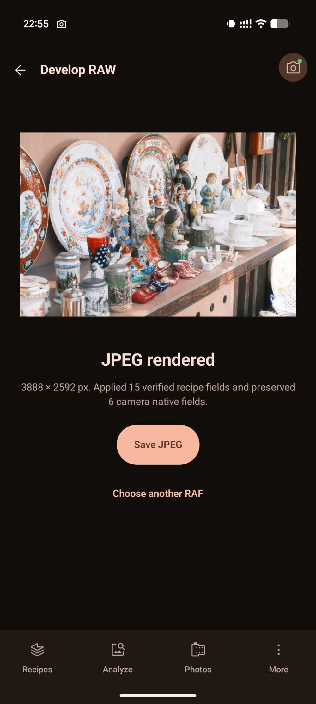 | |
|:--:|:--:|
| **Develop RAW result** — a RAF from the phone, rendered by the camera's own processor with one of your recipes applied. The app uploads the RAF plus a patched native conversion profile, waits for the body to render, and pulls the finished JPEG back. The summary is explicit about what it did: full output size, how many recipe fields were applied, and how many camera-native fields it left untouched rather than guessing at. **Save JPEG** writes it wherever you like through Android's document picker, or pick another RAF and run the same recipe again. | |

## ➕ Creating recipes

| 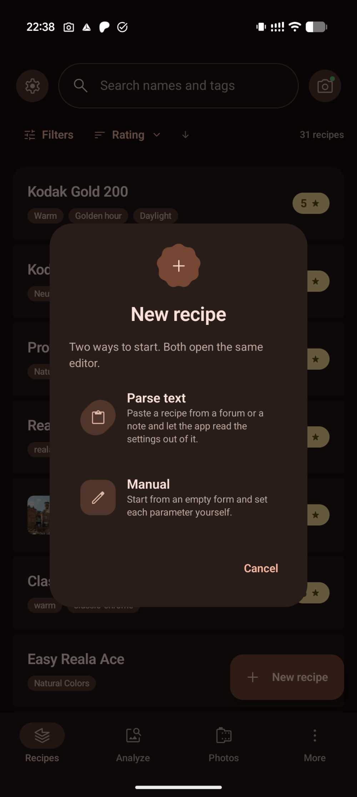 | 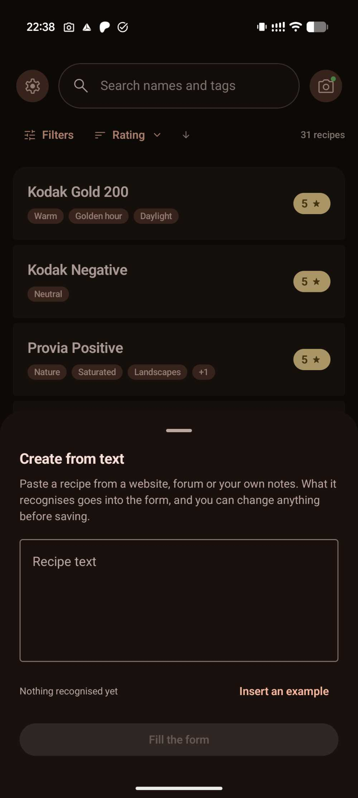 |
|:--:|:--:|
| **Two ways to start** — **Parse text** takes a recipe you copied from a website, forum post or your own notes; **Manual** opens an empty form. Both land in the same editor, so you can always fix up whatever the parser got wrong. | **Create from text** — paste the raw recipe text (for example from *Fuji X Weekly*) and the built-in parser pulls out film simulation, tone curves, grain, Color Chrome and white balance. It tells you how much it recognised before you commit, and **Insert an example** shows the kind of text it understands. Nothing is sent anywhere — the parsing runs on the phone. |

| 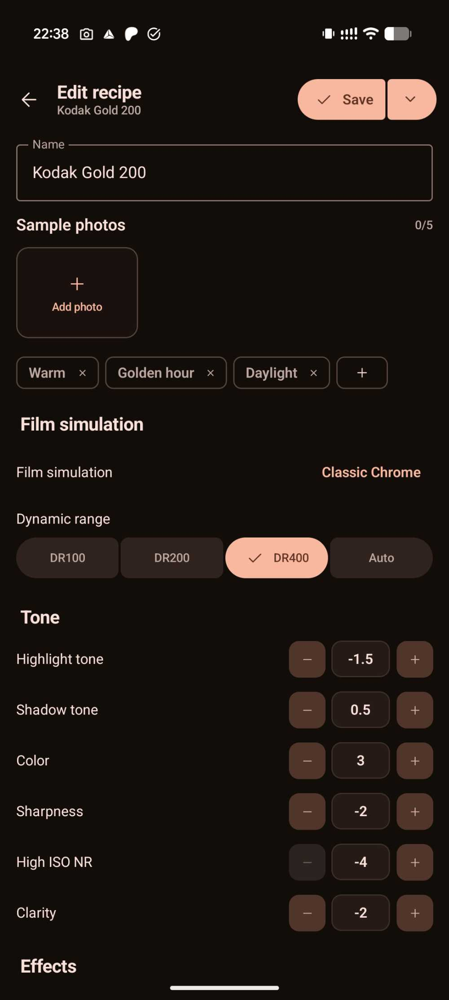 | |
|:--:|:--:|
| **Recipe editor** — name the recipe, attach up to 5 sample photos, add tags, and set every parameter with steppers that enforce the camera's real ranges and 0.5 steps. Dynamic range is a set of chips (DR100/200/400/Auto) rather than free text, so you cannot save a combination the camera would reject. | |

## 🖼 Analysing photos

| 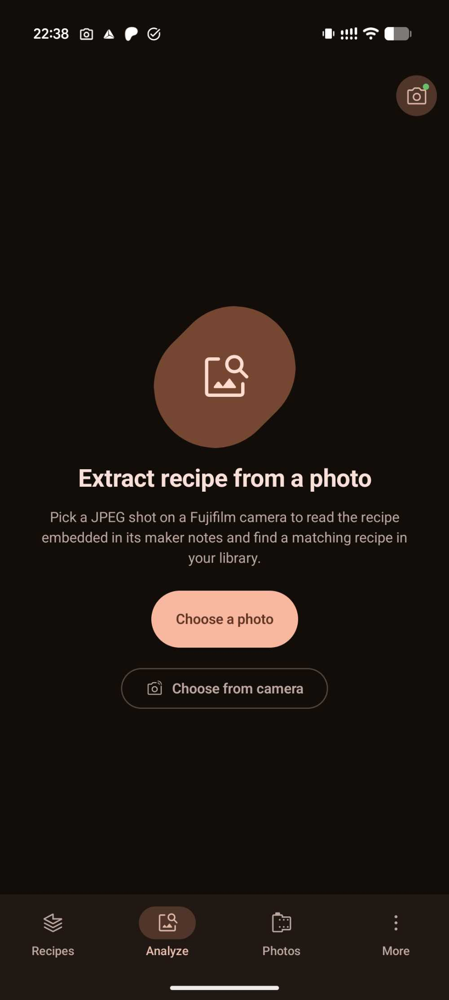 | 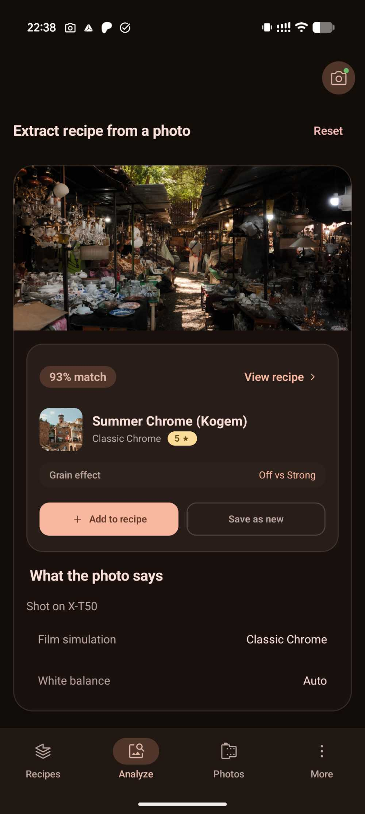 |
|:--:|:--:|
| **Analyze tab** — pick any straight-out-of-camera Fujifilm JPEG and the app reads the recipe out of its MakerNote EXIF. **Choose a photo** uses the phone's gallery; **Choose from camera** reads the JPEG directly off the connected camera card, so you do not have to import it first. The same flow is available from the system share sheet in Google Photos, Gallery or Files. | **Single photo result** — the decoded settings ("What the photo says", including which body shot it) are matched against your whole library. Here the photo is a **93% match** for an existing recipe, with the one differing parameter spelled out (grain effect off vs strong). From there you can attach the photo to that recipe or save the decoded settings as a new one. |

| 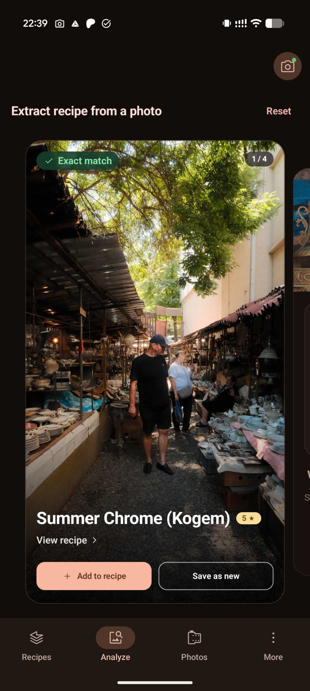 | |
|:--:|:--:|
| **Batch analysis** — select several photos at once and swipe through the results as a full-bleed carousel (1/4 here). Each card shows the photo, its match verdict (**Exact match** when every parameter lines up) and the same add-or-save actions. A quick way to audit a shoot and find out which recipes you actually used. | |

## 🔌 Camera connection & custom slots

| 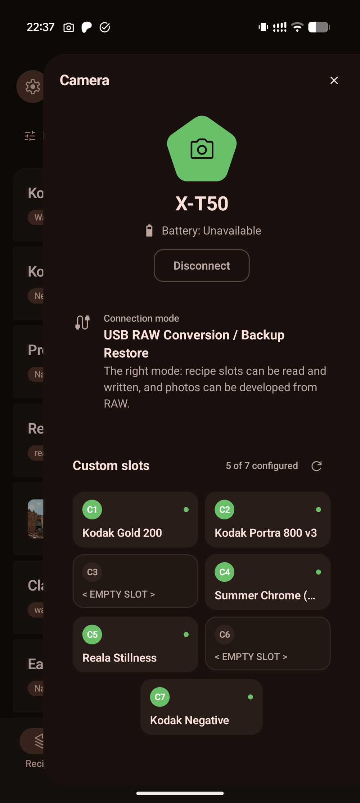 | 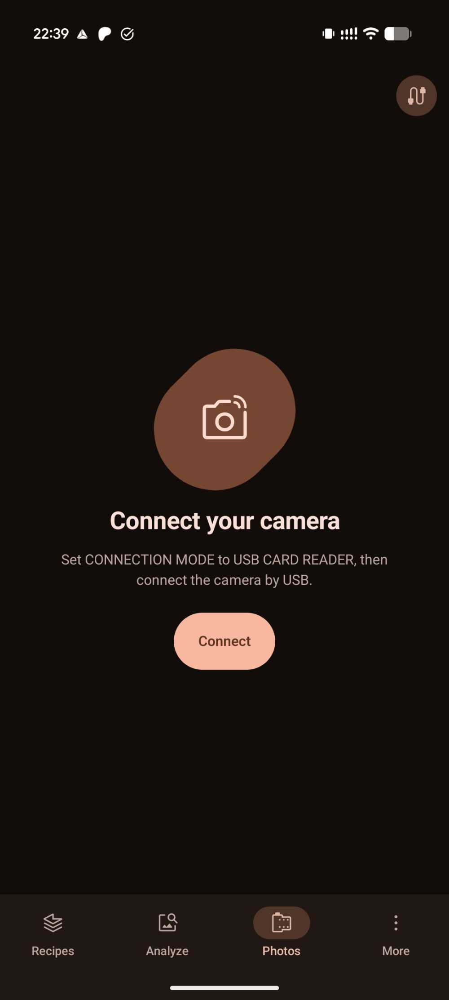 |
|:--:|:--:|
| **Camera sheet — RAW conversion mode** — tap the camera button on any screen to see what is plugged in: model, battery, and the current USB connection mode with an explanation of what that mode allows. In **USB RAW Conversion / Backup Restore** the C1–C7 custom slots are readable and writable; the app shows which slots are configured and which are empty, and the names of the recipes already on the body. | **Camera sheet — card reader mode** — the Photos tab needs the camera set to **USB CARD READER** instead, and tells you so rather than failing silently. Mode-specific features only appear in the mode that can actually reach them, so you never write to a slot the camera has closed off. |

| 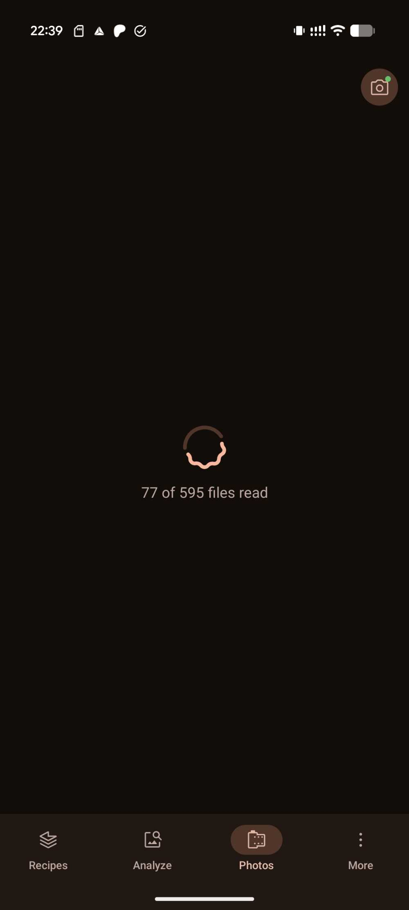 | 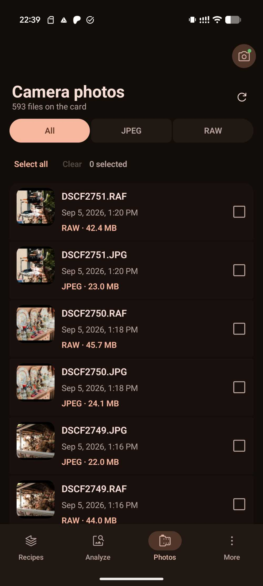 |
|:--:|:--:|
| **Reading the card** — on connection the app walks the card over PTP and reports progress file by file (77 of 595 here). Large cards take a moment; nothing is copied at this stage, it is only building the listing. | **Browsing the card** — every JPEG and RAF on the card with thumbnail, capture time and file size, filterable by **All / JPEG / RAW**. Tick the files you want, or **Select all**. The card is treated as strictly read-only: the app never deletes, renames or moves anything on it. |

| 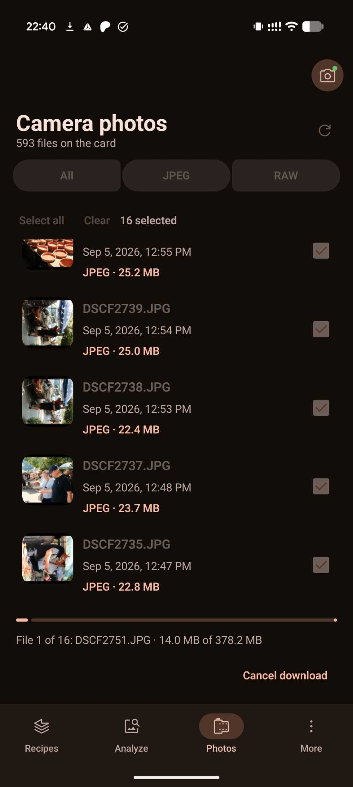 | 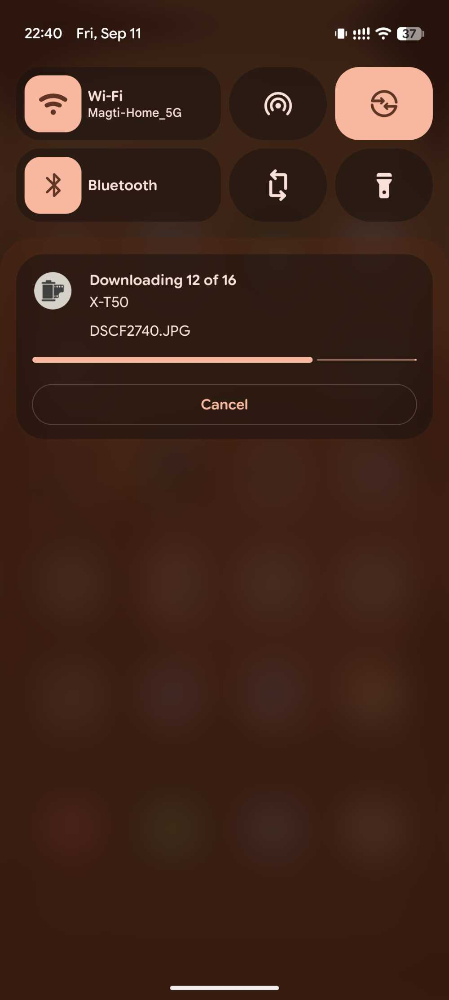 |
|:--:|:--:|
| **Batch download** — pick a destination folder through Android's system picker and the selection copies over in one batch, with per-file and total progress (file 1 of 16, 14.0 MB of 378.2 MB) and a cancel button. If the process is killed mid-batch, the screen reports the interruption and lets you keep the completed files or drop the half-written one. | **Runs in the background** — the download is an Android foreground service, so it keeps going with the app minimised or the phone locked. The ongoing notification shows which file is transferring, overall progress, and offers **Cancel** without reopening the app. |

| 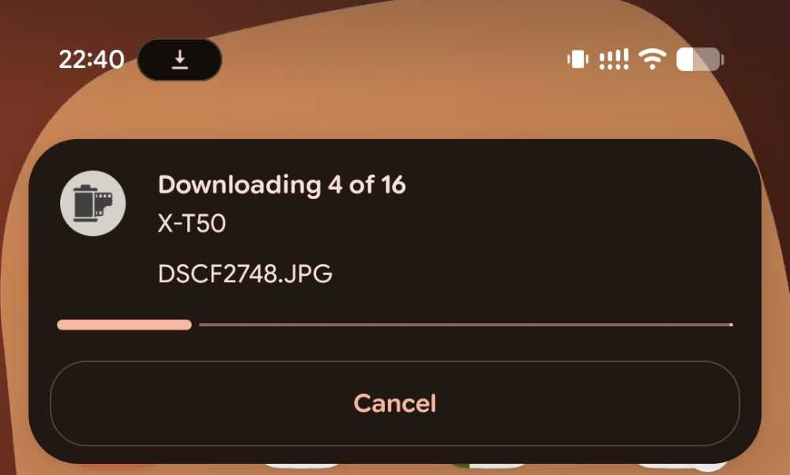 | 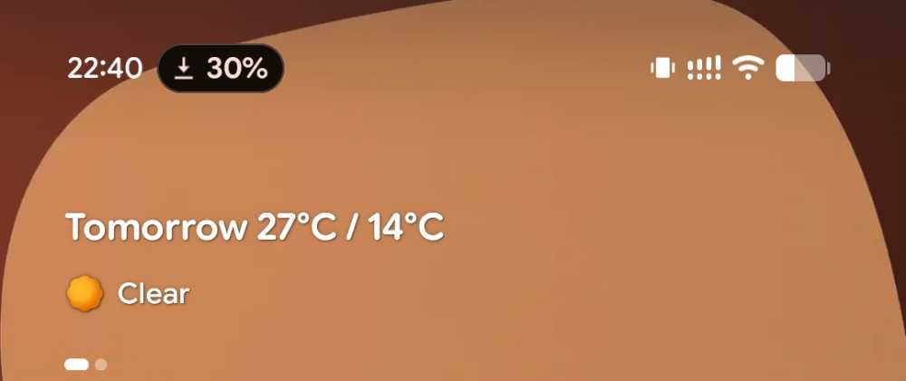 |
|:--:|:--:|
| **Live Update** — on Android 16 the same download is promoted to a Live Update at the top of the screen: camera model, current file, progress bar and cancel, visible over whatever you are doing. | **Status chip** — collapsed, it shrinks to a chip in the status bar with the running percentage, so a long transfer stays visible without taking over the display. |

| 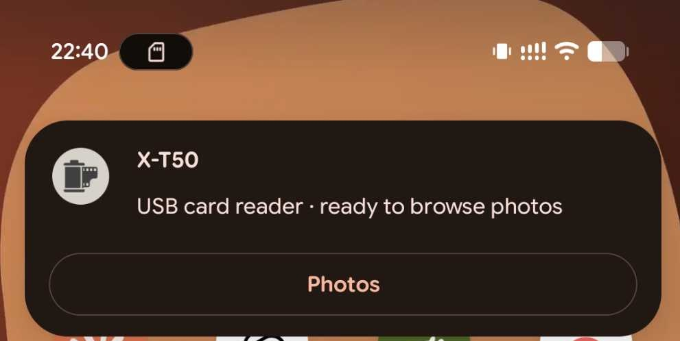 | |
|:--:|:--:|
| **Connection Live Update** — plugging the camera in announces itself the same way: which body is attached, which USB mode it is in, and a shortcut straight into the relevant screen (**Photos** for card reader mode). The app also launches on its own when a supported camera is connected. | |

## 🧹 Maintenance & tools

| 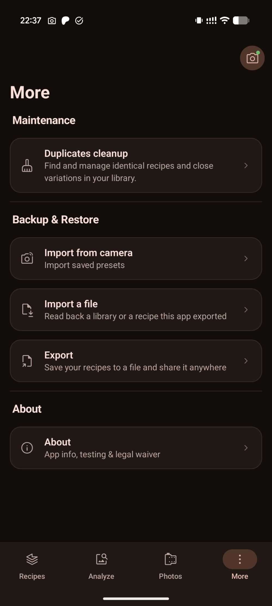 | 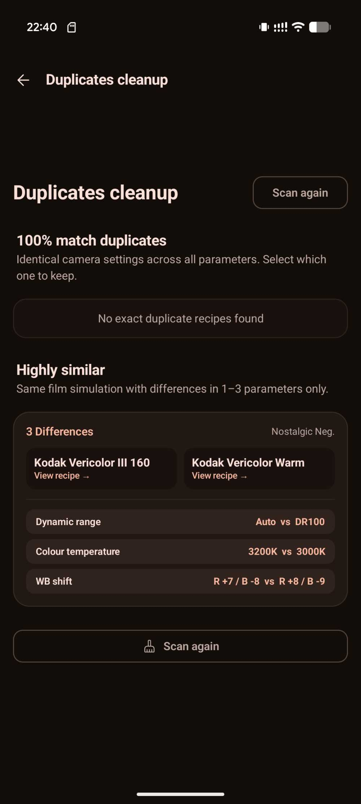 |
|:--:|:--:|
| **More tab** — the housekeeping drawer: **Duplicates cleanup**, **Import from camera** (pull the C1–C7 presets off the body into your library), **Import a file**, **Export** your library as `.json` or `.zip` through Android's share sheet, and **About** with testing notes and the legal waiver. | **Duplicates cleanup** — scans the library for exact duplicates (identical across all parameters) and for **highly similar** recipes: same film simulation differing in only 1–3 parameters. Each pair lists exactly what differs — here dynamic range, colour temperature and WB shift — so you can merge, keep, or knowingly keep both. |
